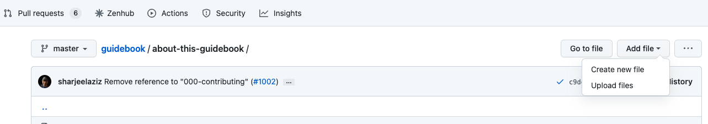
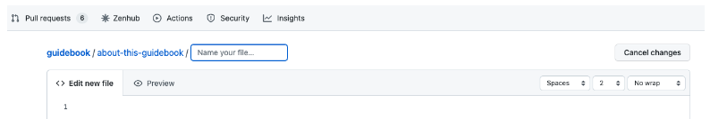
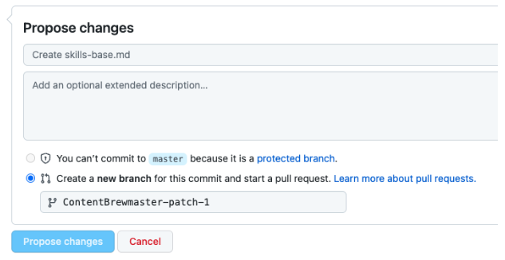
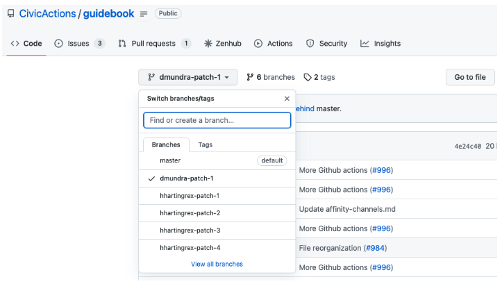
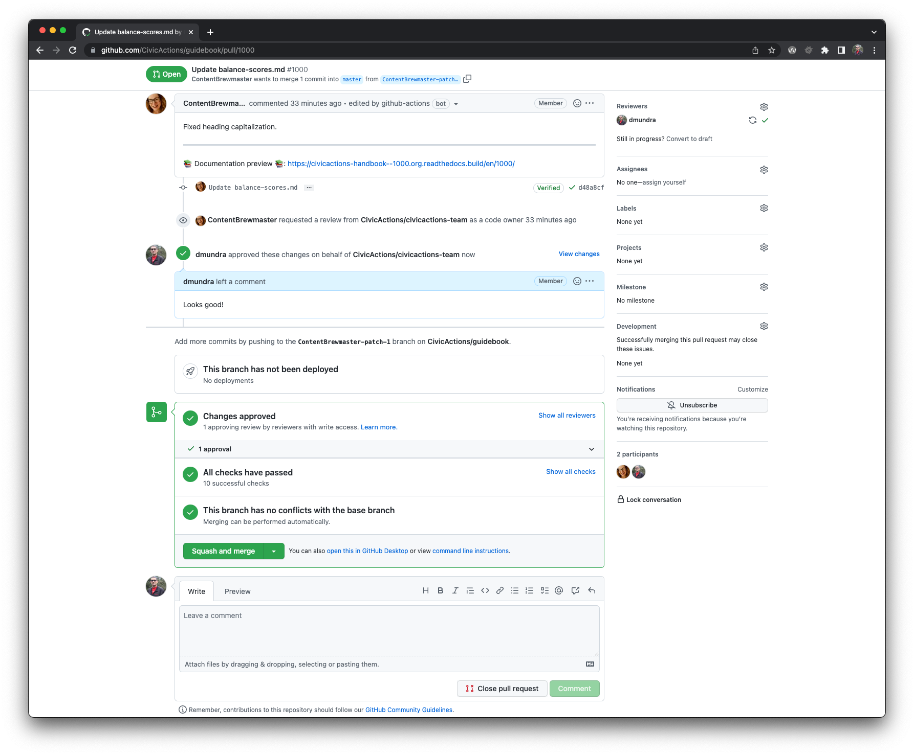

# Editing the guidebook using Git

The guidebook is a collection of markdown files that you can edit in Github.

Git can be confusing at first, but our guidebook is a great place to learn because we use a simple Git workflow, compared to many engineering projects. For example, publishing a sentence or two can take less than 5 minutes, depending on the availability of reviewers.

For the guidebook, the "master" branch is the active branch, with the latest, approved changes published at the URL: [https://guidebook.civicactions.com/en/latest/](https://guidebook.civicactions.com/en/latest/)

## Step 1: Access your GitHub account

New employees receive an email invite to join the CivicActions account. If you missed the invite, you can ask for access by contacting our help desk in the #how-we-work channel and adding the emoji :ticket: to your message.

## Step 2: Make your content changes

### Editing an existing page

-   Go to the guidebook repository (also known as the repo): [https://github.com/CivicActions/guidebook](https://github.com/CivicActions/guidebook).
-   Open one of these folders:
    -   about-CivicActions
    -   employee-benefits
    -   company-policies
    -   common-practices-tools
    -   practice-areas
    -   about-this-guidebook
-   Click on the page you want to edit.
-   Click the pencil icon to edit.
-   Make your changes using markdown.
-   Click the **Preview tab** to make sure everything looks right.

### Creating a new page

-   Go to the guidebook repository (also known as the repo): [https://github.com/CivicActions/guidebook](https://github.com/CivicActions/guidebook).
-   Open one of these existing folders in the repo (do not create a new folder):
    -   about-CivicActions
    -   employee-benefits
    -   company-policies
    -   common-practices-tools
    -   practice-areas
    -   about-this-guidebook
-   Click Add file > Create new file.

-   Name your file, ending with the extension .md.

-   Add your content.
-   Click the **Preview** tab to make sure everything looks right.

## Step 3: Save your changes

When you are ready to save your changes (known in Gitspeak as "make a commit"), you'll see three fields at the bottom of the editing screen. All of these fields are optional, with default values. In most cases it's fine to leave the defaults.

-   The commit title: By default this is something like "Update (filename)". You can leave this as is. If you want to be more precise, keep it short.
-   Extended description: Explain your changes, if you wish.
-   The branch name: By default this will be a new branch.

After you commit, you will be asked if you want to create a new pull request with the branch you created. You'll again be presented with a few fields, which you can generally leave as is.

-   The PR title: By default it is the title of your last commit.
-   Extended description: This also draws from your last commit.
-   The right sidebar: You can assign your pull request to someone on the team (someone you think may want to review your edits).

When you save your changes, Git will create a new branch for your change using the default format (username)-patch-1. This branch is a copy of the entire guidebook. Any changes you make in this new branch do not affect the master branch for the guidebook. Your changes take effect when the branch is merged (Step 7).

If you want to change the new branch name to something more meaningful, such as (username)-easy-github-contributing), that can be helpful to the reviewers, but it's not necessary.

Click **Propose changes**. You've just made a commit.

## Step 4: Make your pull request (PR)

After you've made your commit, Git will ask if you want to create a new pull request with the new branch you just created. **You need to create a pull request before your changes can be reviewed**. You'll again be presented with a few fields, which you can generally leave as is.

-   The PR title: By default it is the title of your last commit.
-   Extended description: This also draws from your last commit.
-   The right sidebar: You can assign your pull request to someone on the team (someone you think may want to review your edits). If you think that certain individuals may have particular subject matter expertise or authority on the topic, you can also assign them directly via the "Reviewers" section.

If you are only changing **one** page, click **Create pull request**. If you are changing more than one page, don't create the PR quite yet.

Find the branch you already created in the [branches list](https://github.com/CivicActions/guidebook/branches) and click on it. Your branch will now appear at the top of the editing screen.

Find and edit another file (or the same file you just edited) and commit it. This time, GitHub will know that you want to commit to the same branch as you created during your first commit.

Once you are done making changes, commit the changes. Then click **Create pull request** to create your pull request from your new branch to the master branch, which will include all changes. Your changes will not yet be public: they first have to be reviewed by a team member.

## Step 5: fix issues caught in testing

We have set up a [testing service](automatic-checking.md) to check if new commits or PRs meet standards. Notifications go to the #docs channel and to your email. If you get a notice of errors, [find your PR](https://github.com/CivicActions/guidebook/pulls) and review the error messages to resolve any coding issues.

If you need help fixing errors, message the [#docs](https://civicactions.slack.com/messages/docs/) channel in Slack.

## Step 6: update the navigation

If you are adding new content or changing the title (H1) of an existing page, you will need to update the settings file containing the navigation labels. If you are not sure where to place your content in the navigation, start a conversation in [#docs](https://civicactions.slack.com/messages/docs/) in Slack.

-   Go to the guidebook repo: [https://github.com/CivicActions/guidebook](https://github.com/CivicActions/guidebook).
-   Click the .config folder to open.
-   Click the `mkdocs.yml` file to open.
-   Click the pencil icon to edit the file.
-   Scroll down to the navigation section ("nav:") and locate either:
    -   the line you want to change, or
    -   where you will insert a new line to add the navigation label for your new content.
    -   If you are adding a new page, use the format: navigation label: file name (with .md).
-   Save your commit and create the pull request. Note the PR number of the content PR in the description field so the reviewer can see the changes in the content.

The PR will be reviewed by a team member before being merged.

## Step 7: merge your pull request

If you're not sure if you should merge something, ask for a second opinion in [#docs](https://civicactions.slack.com/messages/docs/) first.

Click **Squash and merge**.

Click **Confirm squash and merge**.

The changes in the PR are now visible via the public URL. You're done!

## Alternate method

For those more familiar with the Git fork and pull request (PR) workflow, you can fork this repo and make pull requests from your fork. Review the [governance](guidebook-governance.md) for the repo before you make your changes.
