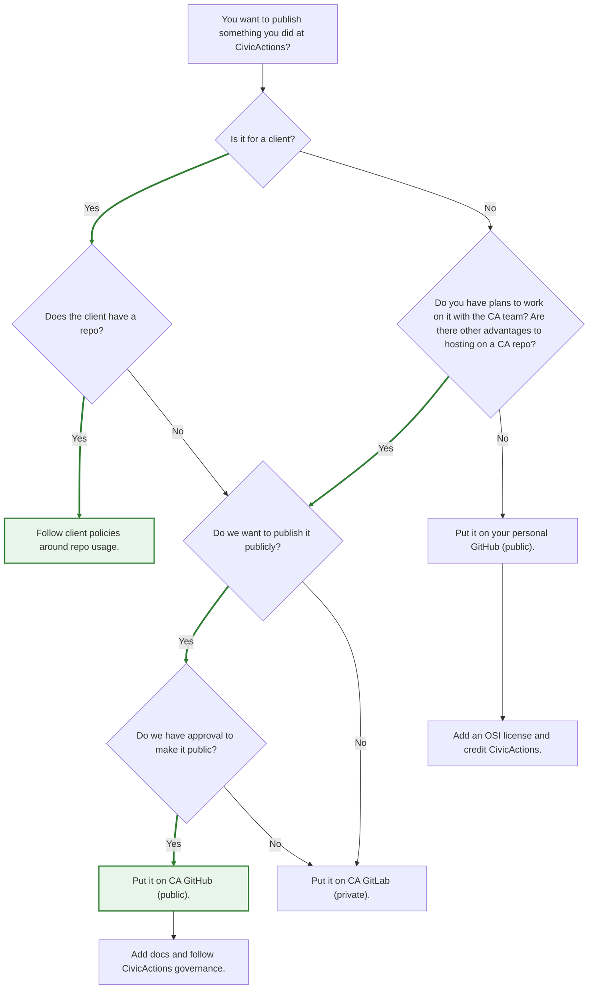

# DRAFT Code Management Guidelines

This is a DRAFT guidance outlines when work should go into the CivicActions corporate repositories (GitHub & GitLab), our client repositories, or a personal repository. The guidance should direct the team how to attribute CivicActions or client support behind the repositories. This is particularly important when experimenting with code on paid time. All projects should have an appropriate license. CivicActions default license should be the [AGPL v3](https://opensource.org/license/agpl-v3), but other [OSI-approved licenses](https://opensource.org/licenses) can also be appropriate.

---

## 1. Governance: Corporate vs. Personal Repositories

CivicActions wants to track Practices (org-wide methods, standards, shared tools), Projects (client or internal initiatives) and Products (open-source tools we want to sustain). We do not want to restrict creativity and experimentation of our team, but we do want to be able to maintain our corporate repositories.

### Corporate public GitHub Repository (use when…)

- The work is **intended to be maintained** beyond the original author's involvement.
- The project aligns with **client delivery, internal tooling, or CivicActions strategy**.
- The code is itended to be **reused, extended, or depended on** by others in the company.
- The work touches on **governance, compliance, or accessibility** standards where CivicActions must show accountability.
- The code is intended to be **shared widely** and is tied to our practices, projects or products.
- Documentation, issue tracking, or contribution from other staff will be needed.
- Build to align with our Check My Repo https://github.com/CivicActions/check-my-repo
- Security, licensing, and support responsibilities fall to CivicActions.

### Corporate private GitLab Repository (use when…)

- If we want to collaborate internally, but do not want to publish the code publicly.
- We may wan to do this as a type of InnerSource project where we want to facilitate collaboration inside of CivicActions.
- This is intended for use for internal projects that do not make sense to open source because they are:
    - too experimental
    - too specific to our needs or
    - entangled in our infrastructure specifics
- If these (or components of them) become potentially useful, those should be open sourced on our GitHub organization.
- Our Gitlab should only be used for private code.

### Personal or Private Repositories (use when…)

- The work is **exploratory, throw-away, or highly experimental**, and may never be maintained.
- The work is part of **personal learning or prototyping** that doesn't yet meet company governance standards.
- The project is tied to **individual interests or experiments** that may or may not align with client work.
- The author wants to test or draft ideas before proposing them for company adoption.

**Rule of thumb:** If CivicActions or its clients will **depend** on it, it belongs in the corporate repo. If it's **personal exploration**, keep it in a personal repo unless and until it becomes company-backed.

## 2. Work for CivicActions' clients

Clients may have their own public and/or private repositories. All work that we do for our clients needs to be mindful of our contractual responsibilities.

- Client repositories (which can be internal or public) should be used for all project code unless we have approval from both:
    - CivicActions legal team (once per-contract - we need to review contract terms) and
    - From the client (specific approval needed for each new project/library).
- CivicActions requires approval from the client before before both:
    - hosting the code outside a client system, and;
    - open sourcing it.
- If CivicActions' clients don't have their own repositories available to us, after obtaining permission from the client, we can use:
- CivicActions GitHub - typically if they want to open source it, or move it to another Github org later on;
- CivicActions GitLab - needed if we also need CivicActions CI infrastructure

---

## 3. Attribution of CivicActions-Supported Work

When staff experiment during CivicActions-paid time, they should acknowledge CivicActions' support while respecting personal repositories. Anyone at CivicActions should feel free to fork a project into the CivicActions repository if it is relevent to practices, projects or products we are working on. With personal projects of staff, it is good to reach out.

- Include a statement in the README of personal repos created on CivicActions time:
    > "This work was initiated with support from CivicActions."
- If the project later becomes useful to CivicActions or its clients, it should be **migrated into the corporate GitHub** and maintained under CivicActions governance.
- Staff are encouraged to **flag experiments** in weekly updates or Slack so others are aware of the exploration, even if it stays in a private repo.
- When in doubt, **err on the side of attribution**. This protects both the individual and the company and demonstrates CivicActions' commitment to open knowledge and stewardship.

---

## 4. Decision Tree

This is a DRAFT guidance outlines when work should go into the CivicActions corporate repositories (GitHub & GitLab), our client repositories, or a personal repository. The guidance should direct the team how to attribute CivicActions or client support behind the repositories. This is particularly important when experimenting with code on paid time. All projects should have an appropriate license. CivicActions default license should be the [AGPL v3](https://opensource.org/license/agpl-v3), but other [OSI-approved licenses](https://opensource.org/licenses) can also be appropriate.

