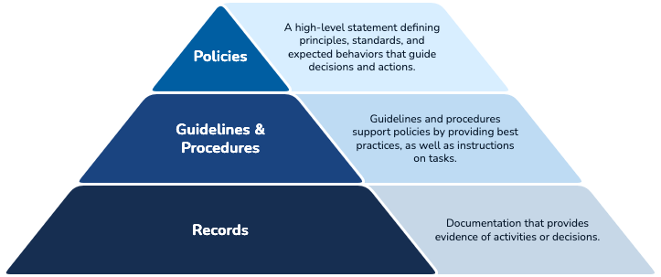
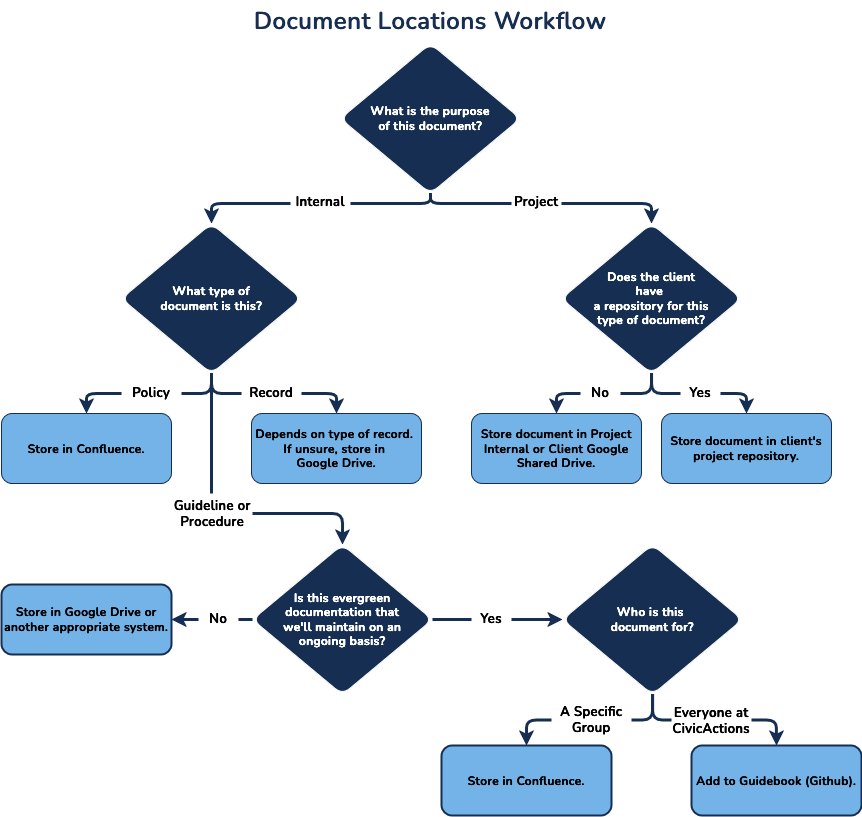

# Document Management Guidelines

This guidance outlines best practices for managing documents within CivicActions. It includes recommendations for creating, storing, classifying, reviewing, approving, and updating documents. This guidance is relevant to all CivicActions employees involved in document management activities, referencing foundational documents such as the [Policy On Policies (MG1022)](https://civicactions.atlassian.net/wiki/x/BoAqFw) and the [Document and Record Control Policy (CP1002)](https://civicactions.atlassian.net/wiki/x/AYCQCw).

[This is controlled document CPDOC-25](https://civicactions.atlassian.net/browse/CPDOC-25).

## Document Types

- **Policy**: A formal, high-level statement outlining CivicActions' principles, standards, and expected behaviors. Policies are mandatory and guide decision-making across the organization.
- **Guideline**: Recommendations, best practices or playbooks that provide additional information and support compliance with policies.
- **Procedure**: Detailed instructions on how to implement policies or processes to perform specific tasks. Procedures support policies through step-by-step guidance.
- **Record**: Documentation providing evidence of activities performed or decisions made. Records are historical and kept for reference and compliance purposes.

## Document Storage Locations

### Step 1: Determine if the Document is for a Project or Internal Use

First, identify the primary purpose of your document.

- **If it is a Project Document:**

    - Ask: Does the client have a designated repository for this kind of document (e.g., their own Confluence or GitHub)?
        - **Yes:** Store the document in the **client's project repository**.
        - **No:** Store the document in the **Project Internal or Client Google Shared Drive**.

- **If it is an Internal Document:**

    - Proceed to Step 2.

### Step 2: Identify the Type of Internal Document

For internal documents, determine which of the following categories it fits into.

- **If it is a Record:**

    - The storage location depends on the specific type of record.
    - If you are unsure where to store it, the default location is **Google Drive**.

- **If it is a Policy:**

    - Store the document in **Confluence**.

- **If it is a Guideline or Procedure:**

    - Proceed to Step 3.

### Step 3: Determine the Maintenance Commitment for Guidelines & Procedures

For documents that are guidelines or procedures, you must decide on the level of commitment to keeping them up-to-date.

- **Is this "evergreen" documentation that we will maintain on an ongoing basis?**

    - **Yes**, it is evergreen and will be maintained:

        - Next, identify the audience for the document:
            - If it is for **Everyone at CivicActions**, store it in the **Guidebook (GitHub)**.
            - If it is for a **Specific Group** (e.g. department, practice area or committee), store it in **Confluence**.

    - **No**, it is a temporary or informal document:

        - Store the document in **Google Drive or another appropriate system**.

### Reference & Examples

| **Audience & type of content**                                            | **Examples**                                                                                                                 | **Location**                                                                                                     |
| ------------------------------------------------------------------------- | ---------------------------------------------------------------------------------------------------------------------------- | ---------------------------------------------------------------------------------------------------------------- |
| Client project information & materials                                    | • Status reports • Project onboarding details • Deliverables                                                           | Client-approved repositories or project internal/client Google Shared Drive                                      |
| Evergreen guidelines or procedures for everyone at CivicActions           | • Company holidays • Organizational structure • Getting IT support                                                     | Guidebook (GitHub)                                                                                               |
| Policies                                                                  | • Time-off policy • Security policy                                                                                       | Confluence                                                                                                       |
| Evergreen guidelines or procedures for a **Specific Group**               | • Practice area information and best practices • Finance team payroll procedure                                           | Confluence                                                                                                       |
| Guidelines or Procedures that are **NOT evergreen** (ephemeral or ad-hoc) | • Food order process for a specific conference/event • Procedure for getting user accounts set up in a new company system | Google Drive or other system as appropriate                                                                      |
| Records                                                                   | • Meeting notes • Timesheets • Polls • Work tracking/checklists • Interview notes • Assessments               | Depends on the type of record. Can include Unanet, Google Drive, Jira, Rippling, Culture Amp, Slack, Greenhouse. |

## Training

- Included in the annual QMS Training Program.
- Part of onboarding for new CivicActions employees.
- Updates communicated via Slack.

## Review

- Reviewed annually by the Compliance team.
