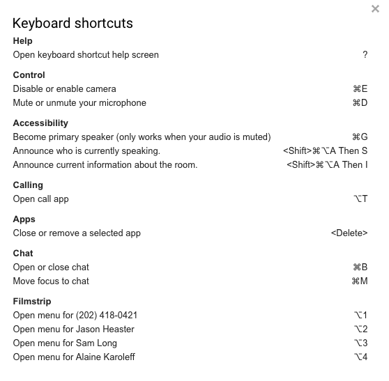

# Google Meet (formerly Google Hangouts)

## Google Meet v Zoom

While Zoom is our default video meeting service, there are a few use cases for using Google Meet.

- If your Zoom meeting is being used by another team member when you want to video meet with someone else, you can create a Google Meet call
- Some clients can access Google products but cannot use Zoom, so your team may default to Google Meet in those cases
- There is no time limit length for Google Meet calls (wheres as Zoom has limits for the basic users)
- With both Google Meet and Zoom, you can share the meeting info (link and dial in info), but with Google Meet you can dial someone into the call yourself
- In Zoom, only the meeting host (or co-hosts) can mute others, but in Google Meet anyone can mute anyone

## Google Meet Specifics

- Use Google Meet video chats in the browser (no download needed
- **You can add a Google Meet to a meeting invite** by clicking "Add conferencing" on the event management page.
- **You can also start or share a Google Meet from Slack** by typing `/hangout`
- **You can dial people into a Google Meet call.**
- A Google Meet invite dialog can generate a phone number that people can call

## Video Call Best Practices

See [Video Call Best Practices](../../company-policies/new-hire-orientation/video-call-best-practices.md) for details.

## Google Meet Accessibility

- There are a lot of [great accessibility features](https://support.google.com/meet/answer/7313544) in Google Meet
- Learning how to [set up live captions](https://support.google.com/meet/answer/9300310) can help you engage with a client trouble hearing. This could be either because of a disability or because of a hardware malfunction.

## Available Commands

- /to, /msg \[user]\[message] - Sends an inline private message to the specified user.
- /shortcuts - Open keyboard shortcut help screen
- /help, /? - Displays a list of command descriptions and usages.
- /goto \[user] - Opens the profile of the specified user in a new tab.
- /mute - Mutes the audio of the caller.
- /unmute - Unmutes the audio of the caller.
- /vmute - Mutes the video of the caller.
- /unvmute - Unmutes the video of the caller.
- /users - Displays a list of participants in the video call.

