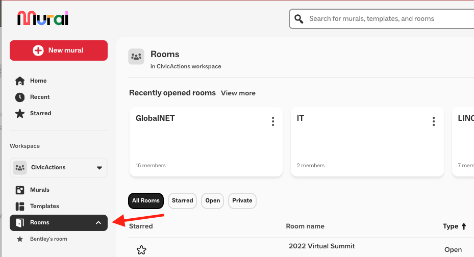

# Mural

The following is a general overview of Mural, but each project may have specific setups or workflows that differ. If you have any questions, please ask in either the [\#mural](https://civicactions.slack.com/archives/C06PASS8S6M) or in [\#how-we-work](https://civicactions.slack.com/archives/C02HFM4KR) slack channels.

## About Mural

CivicActions uses [Mural](https://app.mural.co/t/civicactions3117) as a digital workspace for visual collaboration. It's particularly useful for brainstorming, planning, and design thinking projects. Mural allows teams to work together in real-time, regardless of their geographical locations, and is a powerful tool for enhancing collaborative efforts.

 

## Rooms & Folders

To organize content and properly manage access, we use Mural [rooms](https://support.mural.co/s/article/rooms-in-mural) & [folders](https://support.mural.co/s/article/About-folders).

### Rooms

Each project at CivicActions has its own dedicated room in Mural. Within these rooms, you can find various folders that organize the murals pertinent to that project. If your project does not have a room, or if you need any modifications, you can submit a ticket on the CivicActions support portal [here](https://team.support.civicactions.com/servicedesk/customer/portal/4/group/15/create/59).

You can find the Mural rooms by going [here](https://app.mural.co/t/civicactions3117/rooms) or clicking **Rooms** under the CivicActions workspace.

### Inviting External Users

When working with external users such as government officials, you can invite them to specific project rooms without granting access to non-project rooms or folders. This ensures that sensitive information remains secure while facilitating collaboration with external partners. To request a new external, or any user, [**submit a ticket**](https://team.support.civicactions.com/servicedesk/customer/portal/4/group/14/create/53).

### Organizing Murals

In each project room, murals can be organized into folders and sub-folders. We encourage the use of CivicActions-specific templates to streamline the initial setup phase of a mural. Project leads should have admin rights for managing their project folders. You can find our templates [here](https://app.mural.co/t/civicactions3117/templates).

## Making Changes and License Management

If you need to invite an external user, modify your Mural license, or perform any other changes to your Mural account, [please submit a ticket](https://team.support.civicactions.com/servicedesk/customer/portal/4/group/14).

## Enhancing Templates and Use Cases

If your project has a specific use case or if you have ideas for improving our Mural templates, please share your suggestions in the [\#mural](https://civicactions.slack.com/archives/C06PASS8S6M) or [\#how-we-work](https://civicactions.slack.com/archives/C02HFM4KR) Slack channel by clicking the 🎫 emoji or submit a feature improvement through our [support portal](https://team.support.civicactions.com/servicedesk/customer/portal/4/create/79).

## General Recommendations

- **Utilize Templates:** Start your murals with CivicActions-specific templates to save time and ensure consistency.
- **Collaborative Spaces:** Make full use of Mural's collaborative tools to engage every team member.
- **Stay Organized:** Keep your murals organized within folders and sub-folders to enhance accessibility and workflow.

## Additional Resources

- [Mural Docs](https://support.mural.co/s/)
- [Mural Slack channel](https://civicactions.slack.com/archives/C06PASS8S6M)
