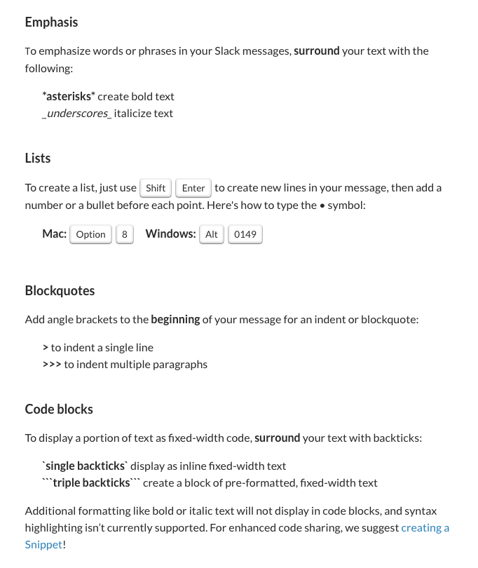
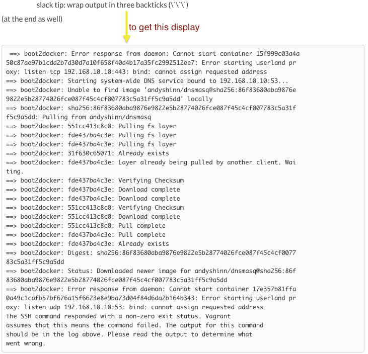

# Slack

We use Slack for chatting with the team, whether as a whole, in smaller groups, or one on one.

## Getting started

-   Ensure your status is set to "available" in Slack when online and free to chat, and "away" when not
-   Consider getting the Slack desktop app - either the native OS X / Windows one, or the Chrome app, which you can set up to run as a standalone app on system start up
-   Make sure to add a photo of yourself for your Slack avatar

## Channels

Slack organizes communication into **channels**. A channel can be public, so that everyone can join, or private, so that messages are shared with only select individuals. Most project channels are private by default.

We default to open, so when in doubt, message the group in a public channel instead of a direct message, or one-on-one.

There are a wide variety of different channels you can join, from work-related to topic-related, including:

-   **Mandatory channels** include: General, Announcements, How We Work, your Pod, your project channels, and your domain area channels (Engineering, Design, PM, etc)
    -   Note that the [Announcements channel](https://civicactions.slack.com/messages/announcements/details/) is for **announcements only**. All replies or conversation regarding announcements can transpire in the [General channel](https://civicactions.slack.com/messages/general/). Keeping announcements chatter to a minimum ensures that anyone who hasn't been paying attention to the General or other channels will be able to quickly locate important or not-to-be-missed information.
-   Optional channels: you are welcome to poke around Slack and join any open channels, such as #pets
    -   to explore our channels, in the left-side navigation, select Channels > Manage > Browse channels

## Notifications

-   To notify someone in particular, type **@name** with your message
-   Consider using the word "ping" to check on the availability of someone
-   If you want to call attention to everyone subscribed to channel, write **@channel** or **@group**
-   To alert only those in a channel/group who are online, write **@here**
-   You can adjust how and when you get notified by Slack activity by selecting Slack > Settings > Notifications

## Formatting your messages

-   Wrap your text in single asterisks for **bold**, underscores for _italics_, `grave accents` for code, and start the line with a > sign to make it a block quote. Formatting in Slack is similar to Markdown.
-   To wrap single line output, use one pair of backticks ( `Your code here`). For multiple lines, wrap with three backticks (`Your code here. Some more code.`). 

### More formatting help

-   [Formatting your messages](https://slack.zendesk.com/hc/en-us/articles/202288908-Formatting-your-message)
-   [Creating a snippet](https://slack.zendesk.com/hc/en-us/articles/204145658-Creating-a-Snippet)

## Integration with Zoom and Google Meet

-   Create a Zoom from Slack: type **/zoom** (will need to authorize)
-   Create a Google Meet from Slack: type **/hangout** (will need to authorize the slack app in Meet/Hangout too)

## Get support for Slack

-   [Request internal support](README.md) for Slack issues
