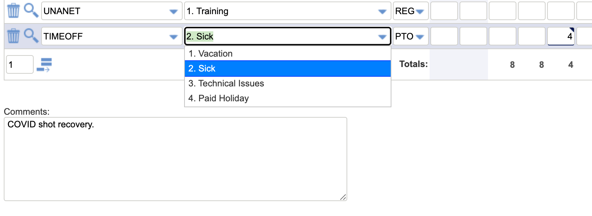

# Unanet

## Introduction

Unanet is an enterprise resource planning (ERP) system that CivicActions uses for time tracking, planning, forecasting and accounting. As an employee, you're responsible for reporting your own time and expenses. Time should be tracked daily and in appropriate categories.

## Logging Time

### How to Enter Time

-   You are expected to enter your times **daily** in Unanet
-   Go to [Unanet](https://civicactions.unanet.biz/civicactions/)
-   To create a timesheet, navigate to Time > Dashboard or Time > List and click +Timesheet (upper right corner above grid).
-   Time billed to the client is in 15 min increments. It will automatically round in the reports, but you'll see actuals in your timesheet.
-   Use your judgement if something took 2 minutes but another task took 10, then consider lumping them together (if they're the same project) to 15 minutes together
-   Read more timesheet [documentation](https://knowledgecenter.unanet.com/display/kb/Timesheet+Training)
-   Watch the Unanet timesheet [video](https://drive.google.com/file/d/1Nnr0KV1sEp2WtOSPDon929216RoJQrH3/view)

### Logging Your Working Expectations

-   A full time employee is slotted for a 40 hour work week
-   Log your time in Unanet accurately. If you spend 6 hours on a project and 2 hours on internal work, ensure the time is logged correctly in the Unanet projects.

### Jogging Your Memory

Many staff at CivicActions are disciplined in keeping track of their hours or are able to work in structured blocks that allow for this to be easily record their time end of each day. If you are unsure you can [check your Gmail](https://mail.google.com/mail/u/0/#sent), [review your Google Drive](https://drive.google.com/drive/u/0/recent), [check Zoom meetings](https://zoom.us/meeting#/previous), examine Slack messages `on:Monday from:me` or look at the GitHub overview when you login.

## Tracking Expenses

Request and Track expenses in Unanet, view instructions [here](https://docs.google.com/presentation/d/1IEl3c8pOAYz5KNM4tVDemjvx5O-5m5WF21r4saANsFw/edit#slide=id.gce6299faa9_0_9)

Before you incur or track expenses be sure to get approval as described in the [expense policy](README.md).

Billable expenses are when a cost can be passed back through to the client. This is usually only the case when the client has an approved budget for travel or other costs. Your project manager will be able to answer questions per project if you are not sure about the cost being billable or not.

## Tracking Time off

We track vacation, leave and sick time, and leave for employees in Unanet. There is oversight on this, but ultimately you are responsible for this accuracy.

-   [Instructions](https://docs.google.com/presentation/d/1IEl3c8pOAYz5KNM4tVDemjvx5O-5m5WF21r4saANsFw/edit#slide=id.gce3d6a447a_0_89)
-   [Timeoff policy (US)](../employee-benefits/README.md#written-documentation-of-time-off)
-   [Timeoff policy (Canada)](../employee-benefits/canada-benefits-policy.md)

**Time:**

-   8 hours for a full day
-   4 hours for a half day

## Support

If you need additional support:

-   Join #unanet in Slack and ping @unanet_support
-   View pinned items in the #unanet slack channel
-   Utilize the [Unanet Knowledge Center](https://knowledgecenter.unanet.com/display/kb/End+User+Training)
