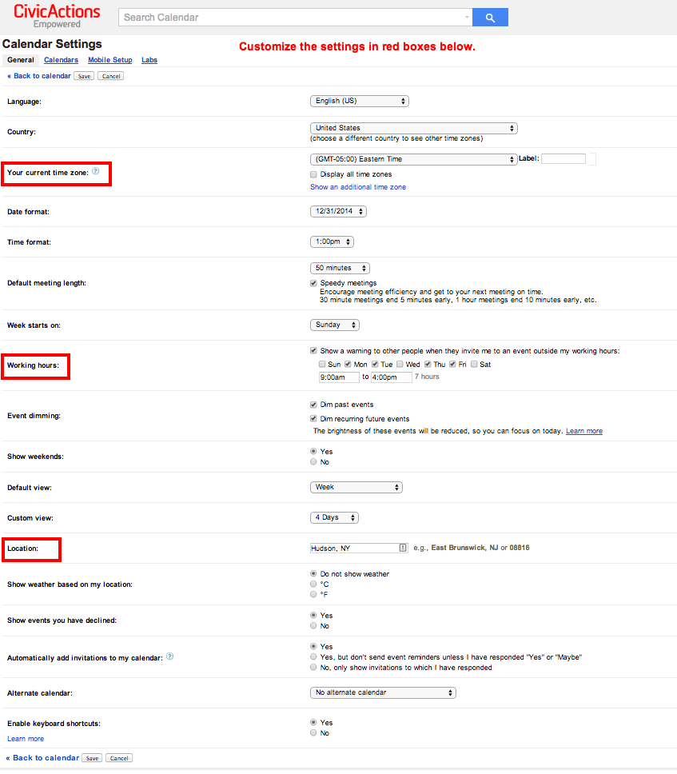

# Google calendar

## Overview

**CivicActions uses shared Google calendars** for CivicActions standing meetings, birthdays, and "out of office" time.

**You can specify which hours you work.** From the guide: "About a third of the way down the "General" settings' page there's a section called "Working hours" and a checkbox that's unchecked by default. If you check it, you can specify your preferred working hours. Once you save your changes, other people will get a warning if they try to schedule you outside those times.

**You can see other people's public calendars to help schedule meetings.** To view someone else's calendar, type their name in the left column under "other calendars." Finally, there's a link titled "Find a time" (left of what's shown in the gif, below) which shows everyone's schedules next to each other so you can easily see when there are no conflicts.

**You can set up blocks of time that people can reserve.** Just select "Appointment slots" after you choose a window of time.

## Best Practices

- Set your location, time zone and working hours (& keep them current) using calendar settings: 
- Always send invitations to <mailto:first.last@civicactions.com>
- Make sure your main <mailto:first.last@civicactions.com> calendar is at sharing at least free/busy with everyone in CivicActions
- Consider enabling "speedy meetings" in Settings to encourage meetings to wrap up early for breaks in between
- Reply to meeting invitations (yes, no, maybe)
- Use the "optional" feature for attendees who are not required to attend (or don't invite them at all!)
- Use the Find a Time feature to identify a meeting time where all required participants are free. 
- Complete the Event Details section and add an agenda when creating an event
- If your event is related to a ticket, then include the ticket reference in the event title (e.g. a Jira RD-19 ticket event could be "Prototype Meeting RD-19")
- Create your Zoom meeting link in the event (ask a UXer or PM if you need to borrow a link for a meeting over 40 minutes)
- You can block off "heads down" time during your days for focus on your project work
- Block of your calendar for personal events where you don't want to get booked by anyone (dr appt, long lunch, pick up the kids, etc)
- Consider showing two timezones on your calendar view to make timezone conversions a breeze (feature in settings)
- When you email the ca-schedule listserv, your OOO time will be added the Out of Office Calendar 
