# Project Management Unanet Tasks and Training Material

## Introduction

Unanet is an enterprise resource planning (ERP) system that CivicActions uses for time tracking, planning, forecasting and accounting. As a project lead, you're responsible for the following Unanet tasks:

1. People planning and assignments for a project
2. Adjust projections for holidays or other time-off
3. Reviewing and approving timesheets
4. Reviewing and approving expenses
5. Runnings reports for the following
   - Plans v Actuals
   - Planned Utilization

## People planning and assignments for a project (Plan with Grid)

### Open Plan with Grid

1. Contracts/Project/List
2. Enter the project code or % and part of the code (eg. %acme)

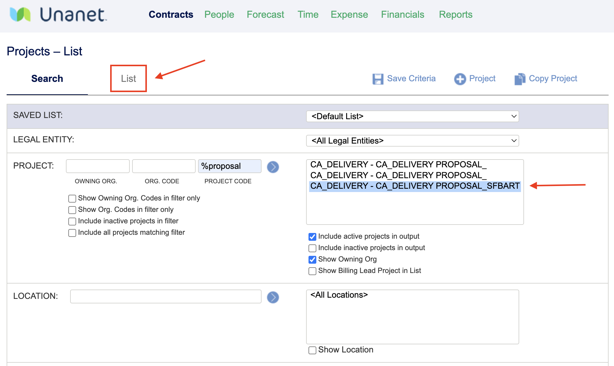

3. Select your project and click on the pencil or double click anywhere on project row (except on an icon) to open Project profile
4. From the left side menu, select People Plans/Plan with Grid

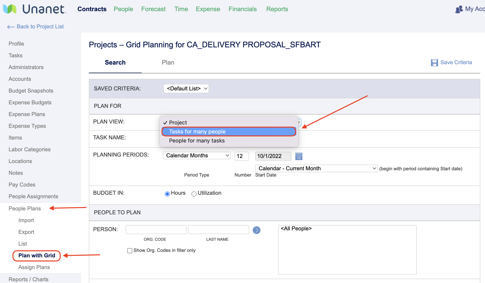

### Create the Grid

1. Change plan view to Tasks for Many People (you can also choose People for Many Tasks, which will show the grid listed by person with all tasks they are assigned to rather than by task with all people assigned to each task).

   - If you wish to only view specific tasks, copy the task name and paste it into Task Name field. Note: if the task name is 9. CLIN 2001 PM, you will need to lose the number and enter CLIN 2001 PM
   - If you don't select specific tasks, the grid will show all tasks including inactive ones and non-billable

2. Select planning period criteria

   - Calendar Months
   - Choose how many months to plan for
   - Choose the start date of your plan by entering the date or using the dropdown menu

3. Budget in Hours or Utilization (most people select hours)

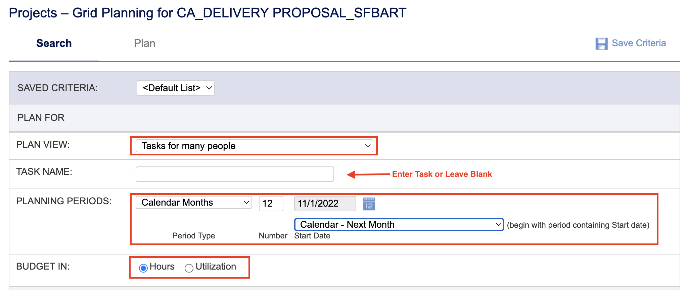

4. Select People to plan for by entering their last name (or the first few letters of their last name) or %, which will show a list of all people you can add to your plan, whom you may select by highlighting

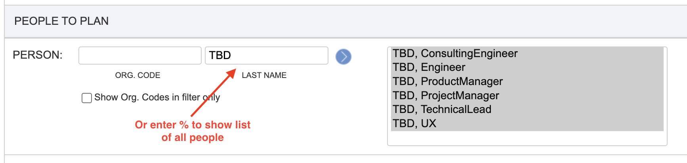

5. You can also plan using other criteria (labor category, location, skills)
6. You can color code the plan using people utilization (showing red if a person is already booked at 100% or above for example)
7. Click on Plan at the top of the screen to view the grid

### Using the Grid

1. Find the task you wish to plan
2. Enter the allocations (# of hours) by month

   - Month by month, person by person (ie. entering a figure in each field)
     Consider leave requests, holidays, conferences and so on
   - ** IMPORTANT ** Double click on every person's name who you are planning for to enter the correct labor category for the project. If you don't do this, the invoice may be incorrect and you will need to alter them all for every assignment for every person month by month
   - Note re above: Assigning a labor category is done by task, it does not translate to all tasks, even if you choose the "People for many Tasks" option

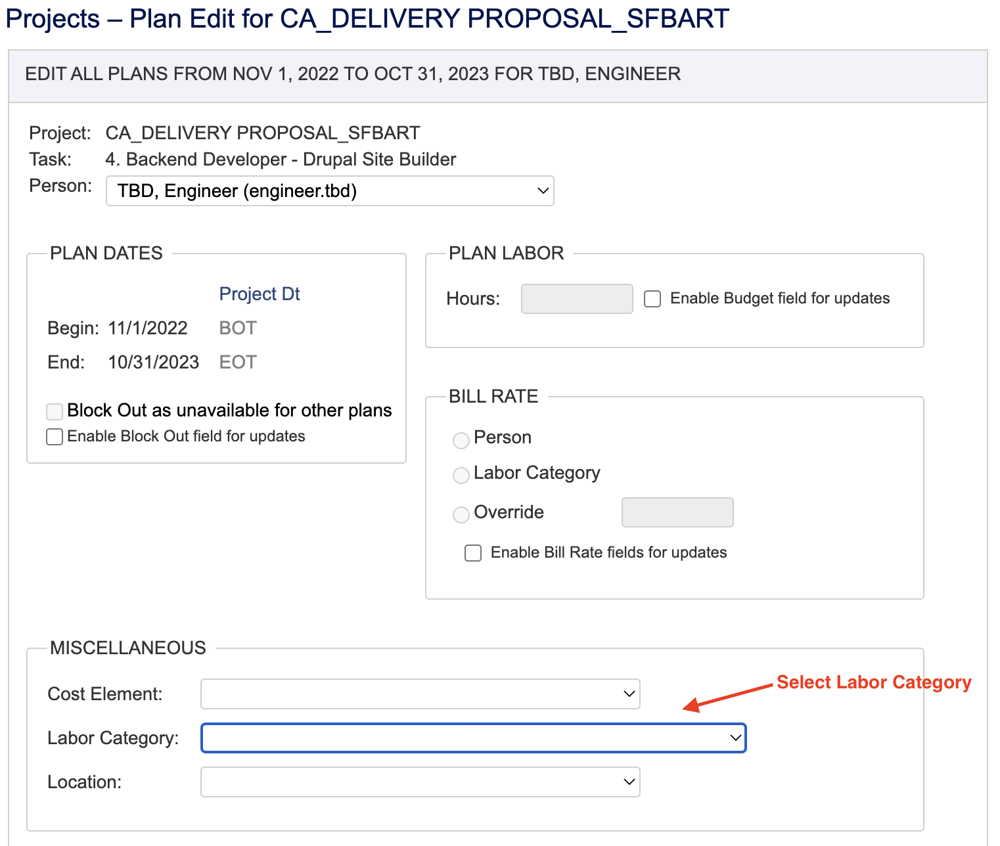

3. Click on Save
4. If you are finished, you may click on Assign

   - You will have an opportunity to double check your plan at this point
   - You will also have an option to check the Exceed box to allow a person to exceed the number of hours you have allocated for them (if FFP, you may wish to check this box)
   - You will have an opportunity to notify different people about the plan you have created
   - Select the plans you wish to save by clicking on the "Assign" box at the beginning of each plan (or the one above to "assign all")

### Tips

You may enter multiple hours/month on the planning grid rather than one month per person at a time. You can do this multiple ways.

1. For the same number of hours for every person for every period - Double click on the space to the left of the first month in the header

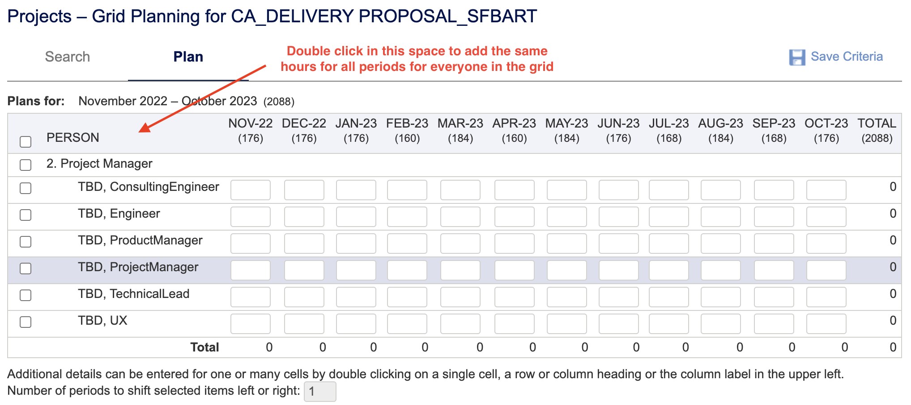

- You will be directed to the following screen where you can "enable budget field for updates" and enter the hours you wish to allocate per person per month.
- You can also enter the labor category here if it is the same for each person.

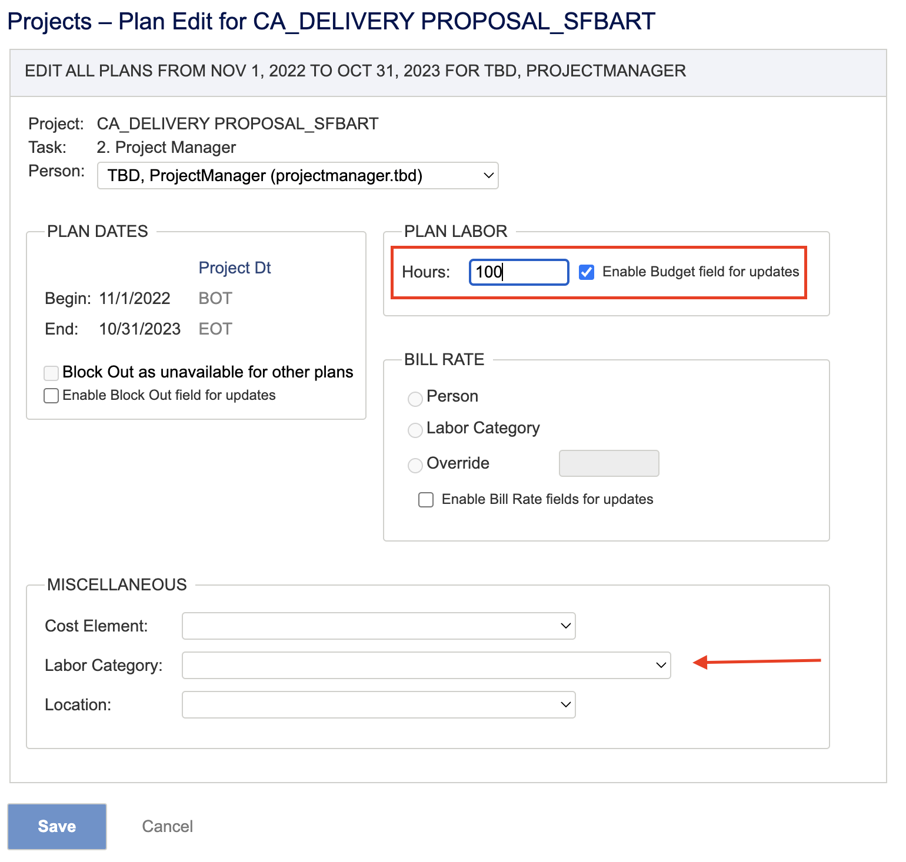

2. For the same number of hours for an individual for every period - Double click on the name of the person

   - You will be directed to a similar screen where you can "enable budget field for updates" and enter the hours you wish to allocate for that person for each month.
   - You can also enter the labor category here.

3. For the same number of hours for each person for a particular month - Double click on the month at the top of the page

   - You will be directed to a similar screen where you can "enable budget field for updates" and enter the hours you wish to allocate for each person for the selected month.
   - You can also enter the labor category here if it is the same for each person

## Adjust projections for holidays or other time-off

In general, resource allocations can be expected using the following rations:

1. If a FT resource devoted to the project, then 80%
2. If an AD resource devoted to the project, then 65%
3. If a PT resource devoted to the project, then 40%

From that place, then deduct - monthly - for any of the following:

1. holidays
2. OOO
3. Any other events, e.g., summits, etc.

Pro Tip: For finding OOO dates on the calendar, use the CivicActions shared calendar and try searching "name OOO". This will allow you to isolate the forthcoming dates for the given person.

## Reviewing and approving expenses

1. Find your approvals
   1. Click on the Unanet logo
   1. Scroll down to Approvals
   1. Look for Expense Reports and/or Requests and click on Primary Approvals to view
   1. 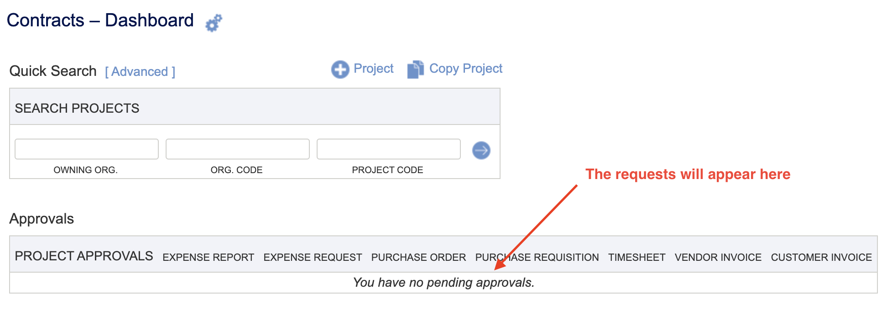
   1. NOTE: All expense reimbursements except for ProDev < $50 should be submitted as a REQUEST first.
   1. To check this quickly:
      1. Click on the magnifying glass next to the expense report
      1. Scroll down to Approval History
      1. A report that has previously been a request will show 'PreApproving' and 'PreApproved' statuses in the history. If it has never been a request, you will only see 'Approving' and/or 'Completed'. (See below for explanation of statuses and an example of an expense request and report approval history).
   1. To check this by viewing the person expense approval history:
      1. People/List/Type last name in Last Name field and click blue > then List
      1. Click on the dollar icon
      1. Click on 'Completed Expense Requests' to view
1. Review the REQUEST
   1. Click on the magnifying glass to view all details
   1. Check the project type and expense type are correct
   1. Approve or Disapprove as you see fit - you do NOT need to check ProDev usage - We do that as part of the project approval process before the request reaches you.
1. Review the REPORT
   1. Make sure there are no duplicates
   1. Click on the magnifying glass to view all details
   1. Check the amount, project type and expense type are correct
   1. Click on attachments to open the receipt and double check the details
   1. Checklist
      1. Receipt should be attached
      1. Check project/expense type
      1. Check the receipt date (should match date entered in Unanet)
      1. Check the receipt amount (should match amount entered in Unanet)
      1. Check the credit card number does not end in xxxx. If it does, then the receipt needs to be associated with our company credit card and not reimbursed. If it is the company credit card, click on "disapprove" and ask the  requestor to resubmit with "x Visa" for Payment Method (on the Details page)
         1. If there are any problems with the the report, click on "disapprove" and let the requestor know why you have disapproved it
         1. If all looks good, click on 'Approve'

**Expense report and request statuses and what they mean:**

### Requests

- Requesting - user is still editing the request
- Preapproving - user has submitted the request (remains in this status until the final manager has approved)
- Preapproved - All approvals have been given for the request, which now becomes a report (in the "In use" status and will need to be submitted)
- Denied - the expense request has been denied

### Reports

- In Use - user is still editing the report
- Submitted - user has submitted the report
- Approving - the first manager has approved but others are pending
- Disapproved - a manager has disapproved the report; user may edit at which time the report becomes In Use until submitted again
- Completed - the report is fully approved
- Extracted - the administrator has pulled the report into accounts payable to await reimbursement

## Running reports

### Plans vs Actuals

This report will show you your project personnel planned hours and actual hours.
This report is useful for spotting anomalies such as a terminated employee in the project plan, or a person over-utilized in a project plan, and so on.

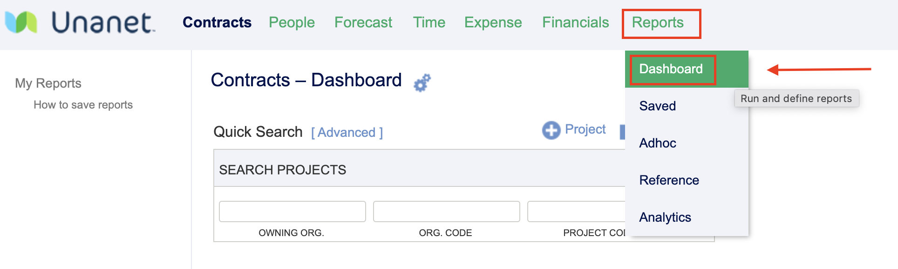

1. Reports / Dashboard
2. Scroll down to Project Reports (Time & Expense Only)
3. In the Periodic Reports box, select Performance

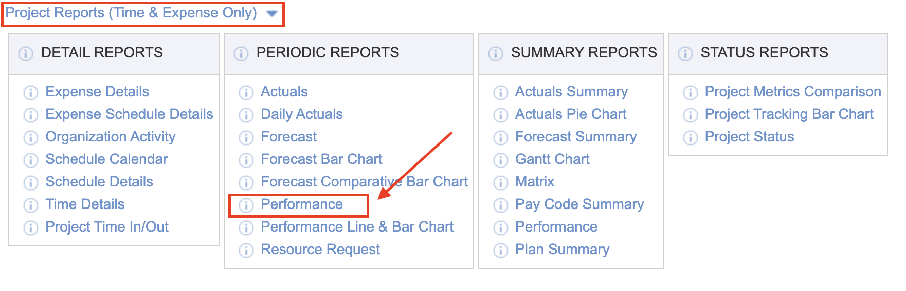

4. Make sure "Report On:" shows "All Projects I can see"
5. Enter the project code or project type

   - For specific projects, find the Project Code field and enter the project code or use the wildcard % with part of the code (eg. %gnet) and click on the blue arrow to select
   - For all billable projects you have access to, find the Project Type field and enter %b- and click on the arrow to select

6. Scroll down to "Reporting Period" and select the following:

   - Month
   - Start date (we recommend at least a couple of months prior for comparison purposes)

7. In the next field "Number of Periods", select the number of months you wish to view
8. Scroll down to Row Options and select only Show Plans and Show Actuals
9. Underneath, in Column Options, select Show Projects (if you are viewing more than one project) and Show People
10. Run Report

REMINDER: Unanet does not automatically reduce planned hours for company holidays. Therefore, be sure to include these adjustments in your weekly assessments.

### Planned Utilization

This report will show you the planned utilization of various personnel

- The % highlighted in red are those over planned (over 100%)
- The % highlighted in yellow are those under planned (under 80%)
- The % highlighted in green are planned for 80-100%
- You can click on a person's name to see how many hours they have been planned over various projects

1. Reports/Dashboard
2. Scroll to People Reports section
3. In the Periodic Reports box, select "Resource Allocation"

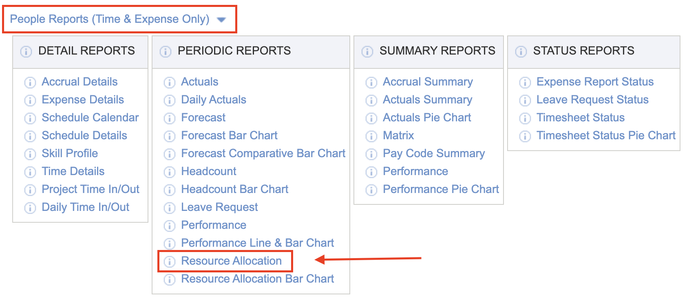

4. Make sure REPORT ON: is set to "All People I Can See"
5. Scroll down to REPORTING PERIOD and set to your desired view

   - You may want to check Month and set the start date as "Calendar - Previous Month"

6. In NUMBER OF PERIODS set the number of periods you wish to view

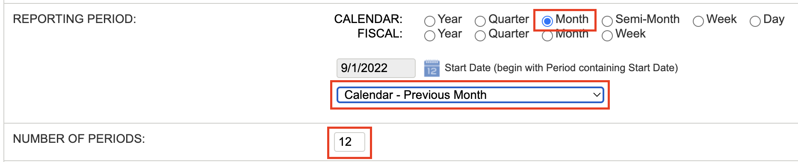

7. In COLUMN OPTIONS, uncheck "Show People Organizations"
8. In LEAVE REQUESTS, check "Include Leave Requests"

   - You can check to include unapproved leave requests

   Note, this will not include any detail, it will merely highlight the months that include leave requests

9. In BOOKED % COLOR, change the middle line "For % from" to 80
   - The previous line "For % to" will automatically change to 79

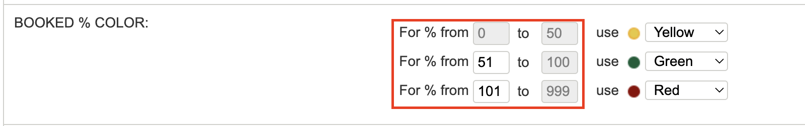

10. RUN Report

#### Save the report to your dashboard

1. After running the report, click on "Back to Criteria"
2. Click on "Save Criteria" at the top of the screen
3. Name your report as you see fit (Planned Utilization Report for example)
4. Save to the dashboard(s) of your choosing
