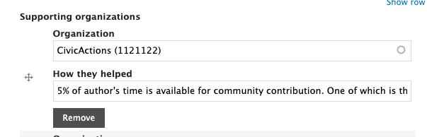

# Drupal practice area

Drupal is a CivicActions engineering-focused [practice areas](../../../practice-areas/README.md). We use the [#engineering-drupal](https://civicactions.slack.com/archives/C0ASJ7C8P) Slack channel and have monthly calls.

## Drupal practice area calls

To be invited to the monthly call, please post a message in the Slack channel and one of your colleagues will add you. You can also find the call on our CivicActions (Primary) calendar.

Drupal engineers meet each month on Zoom to discuss topics of common interest. You are encouraged to share your contributions to Drupal.org and the CivicActions Drupal practice area in the Slack channel and on the monthly call.

The monthly meeting itself is normally scheduled early in the month and follows either a pre-set agenda or the Festivus Format. In the past we have run a [Festivus](https://en.wikipedia.org/wiki/Festivus) style agenda, which is: 1. One or more Feasts (a discussion, a demo, a presentation), 2. General time of sharing our Feats of Strength, and Airing of Grievances. These formats are not set in stone, though; feel free to suggest another format entirely. Even better: volunteer to lead the next call and try something new out!

We add agenda items and notes to this document: [2024 Drupal Practice Area Meetings and Agendas](https://docs.google.com/document/d/15FEPQM_AHriQUq1wCH6FMf3Y6KSsYtb29LaQg0jzXBU/edit) to structure our conversations.

## Drupal practice area OKRs

CivicActions adopted a standard practice of setting Objectives and Key Results in 2020, based on learnings gleaned from this book: [Measure What Matters](https://www.whatmatters.com/the-book)

We are still in the process of optimizing our OKR practices. That said, Drupal practice area participants have developed practice area OKRs that merge with CivicActions organizational objectives. OKR discussions happen frequently in practice area calls and via:

-   [Trello board](https://trello.com/b/MH1OIHzV/drupal-practice-area-okrs)
-   [Culture amp](https://civicactions.cultureamp.com/performance/new_goals/department)

## Skillsbase: complete a self-assessment of your Drupal skills

Please complete a skills assessment as part of your onboarding to the Drupal practice area if you have not done so.

-   [Drupal Skills Categories](https://app.skills-base.com/skillcategories/view/id/16)
-   [Skills Assessment](https://app.skills-base.com/people/view#assessments)

## Got a Drupal problem? We're all here to help!

One of our most cherished practices is the "30 minute rule" which states, "If you are stuck on a problem for 30 minutes, you need to ask for help."

One important use of the [#engineering-drupal](https://civicactions.slack.com/archives/C0ASJ7C8P) channel is to reach out to other CivicActions Drupal engineers to ask for help on specific Drupal problems.

When asking for help provide a context for the issue, describe (or display) the problem, and describe what approaches you've already taken to solve the problem. If you can summarize the nature of the problem in the first sentence, it's more likely you'll get a quick response.

CivicActions engineers all strive to be very helpful, so it's rare for a question not to get a response within a few hours. If for some reason you don't get a response, try a different wording or expand on things you have tried.

## Contributions to drupal.org

We strongly encourage all CivicActioners to look for opportunities to give back to the Drupal community. To track contributions follow the instructions below. Tracking community contributions helps our Practice Area see and appreciate your contributions. It also helps our organization as a whole!

### Update your drupal.org profile

-   Go to <https://drupal.org/>.
-   Log into your drupal.org account (create one if you do not have one).
-   Align it with CivicActions in the "Work" section: Edit profile > Then expand the Work section > Type in "CivicActions" and your Job title.
-   Align your role with CivicActions in the "[Contributor roles](https://www.drupal.org/community/contributor-guide/find-your-role)" section: Edit profile > Then expand the Contributor roles section > Type in "CivicActions" in "Organization support".

### Contribution to drupal.org modules and themes

If you have created or are creating a module or a theme and use CivicActions time to work on it — either for a client or as professional development/community participation time — please make sure to add CivicActions under "Supporting organizations" when editing the module or theme. An example screenshot of what the checkbox looks like:

Adding the organization will ensure that the module and theme will also be attributed to CivicActions. Examples of that can be seen under [CivicActions Drupal profile page](https://www.drupal.org/civicactions#projects-supported).

### Contributing to drupal.org issues

If you are contributing to drupal.org issues for CivicActions and our customers, please make sure to click the box under "Attribute this contribution". An example screenshot of what the checkbox looks like:

Checking the box and adding the organization and customer will ensure that any credit you receive will also be attributed to CivicActions and the customer. Examples of that can be seen under [CivicActions Drupal profile page](https://www.drupal.org/civicactions#org-page-issue-credit).
