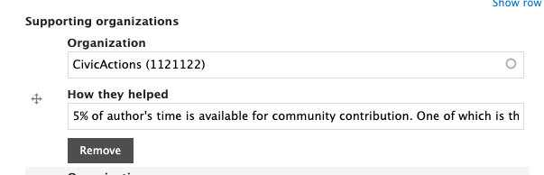
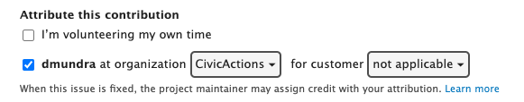

# Drupal for Drupal engineers

## Follow coding standards

We strictly follow established coding standards. Standardized code is more readable and easier to maintain. See the Drupal docs for the latest guidelines: https://www.drupal.org/docs/develop/standards

## Contributing upstream

Whenever practical, we want to contribute our changes back to the Drupal community. If a change requires us to patch core or a contributed module, that patch should also be attached to a drupal.org issue.

First, search the Drupal project for an issue matching the change you need to make. There may already be a patch providing the functionality.

If you end up using an existing patch, drop a comment indicating that you tested the patch and that it is working (or not) for you. This will help move the issue along its lifecycle.

If you need to create your own patch, attach it to the issue and update it accordingly. Ensure that the patch file is named according to convention and includes the issue number so that it is convenient to find.

Your project's technical lead can show you where patch files are stored in your project and explain how they are applied.

https://www.drupal.org/community/contributor-guide/reference-information/quick-info/life-cycle-of-an-issue
https://www.drupal.org/docs/develop/using-composer/using-composer-with-drupal

## Version control and the code review process

CivicActions uses git for version control. Your project's technical lead will explain the process in place for your project and ensure you have access to the relevant repositories. One of your responsibilities as a programmer is to review your peers' changes before merging them.

When reviewing a change, consider the following factors:

1. Does the change follow established coding standards? Be picky; we want to hold our code to the highest standards.
2. Is the code well documented? Good documentation answers the question "why?", not "what" or "how."
3. Is this code that you want to maintain going forward? If anything is unclear to you, this is the time to get it clarified.
4. Are there any typos or bugs?
5. Does the code make any assumptions that may not always be true? For example, assuming an array key exists that might not?

## Resources and opportunities

### Drupal practice area

Drupal is one of CivicActions Practice Areas. We use the #engineering-drupal Slack channel and have monthly calls.

To be invited to the monthly call, please post a message in the Slack channel and one of your colleagues will add you. You can also find the call on our CivicActions (Primary) calendar.

Drupal engineers meet each month on Zoom to discuss topics of common interest. Make sure you have been added to the calendar invites. You are encouraged to share your contributions to Drupal.org and the CivicActions Drupal practice area in the Slack channel and on the monthly call.

The monthly meeting itself is normally scheduled early in the month and follows either a pre-set agenda or the Festivus Format. The Festivus format agenda includes:

1. One or more Feasts (a discussion, a demo, a presentation)
2. General time of sharing our Feats of Strength, and Airing of Grievances.

These formats are not set in stone, though; feel free to suggest another format entirely. Even better: volunteer to lead the next call and try something new out!

More recently, we've been adding agenda items and notes to this document: 2022 Drupal Practice Area Meetings and Agendas to structure our conversations.

### Drupal practice area OKRs

CivicActions adopted a standard practice of setting Objectives and Key Results in 2020, based on learnings gleaned from this book: https://www.amazon.com/Measure-What-Matters-Simple-Drives/dp/024134848X/ref=sr_1_1

We are still in the process of optimizing our practices in this area. Drupal practice area OKRs have been developed that align with CivicActions organizational objectives. OKR discussions happen frequently in practice area calls and

-   Trello board: https://trello.com/b/MH1OIHzV/drupal-practice-area-okrs
-   Culture amp: https://civicactions.cultureamp.com/performance/new_goals/department

### Skillsbase: Complete a self-assessment of your Drupal skills

A previous year's objective was to gather an inventory of the skills of Drupal Practice Area participants. As part of your onboarding, you should have already completed the skills assessment. If not, you should consider completing it as part of your onboarding to the Drupal practice area.

Login to the [CivicActions Skills Base organization](https://app.skills-base.com/o/civicactions).
Onced logged-in, you can view the [Drupal skills categories](https://app.skills-base.com/skillcategories/view/id/16) and take (or update) your [skills assessment](https://app.skills-base.com/people/view#assessments).

### Gotta Drupal problem? We can help!

One of the most cherished practices is the "30 minute rule" which states, "You are only allowed to be stuck on a problem for 30 minutes before you ask for help."

The #engineering-drupal channel in Slack is used to reach out to other CivicActions Drupal engineers to ask for help on specific Drupal problems.

When you ask for help, it's a good idea to provide a context for your problem, describe (or display) the problem, then describe what approaches you've already taken to solve the problem. If you can summarize the nature of the problem in the first sentence, it's more likely you'll get a quick response.

CivicActions engineers tend to be very helpful, so it's rare for a question not to get a response within a few hours. If for some reason you don't get a response, try a different wording or expand on things you have tried.

### Contributions to drupal.org

We encourage all CivicActioners to give back to the Drupal community (see community participation). To track those contributions, follow the instructions below. Doing this helps our Practice Area to be aware of and appreciate your contributions. It also helps our organization as a whole!

Update your drupal.org profile

1. Go to https://drupal.org/.
2. Log into your drupal.org account (create one if you do not have one).
3. Align it with CivicActions in the "Work" section: Edit profile > Then expand the Work section > Type in "CivicActions" and your Job title.
4. Align your role with CivicActions in the "Contributor roles" section: Edit profile > Then expand the Contributor roles section > Type in "CivicActions" in "Organization support". See https://www.drupal.org/community/contributor-guide/find-your-role for more details.

### Contribution to drupal.org modules and themes

If you have created or are creating a module or a theme and use CivicActions time to work on it — either for a client or as professional development/community participation time — please make sure to add CivicActions under "Supporting organizations" when editing the module or theme. An example screenshot of what the checkbox looks like:

Adding the organization will ensure that the module and theme will also be attributed to CivicActions. Examples of that can be seen under https://www.drupal.org/civicactions#projects-supported.

### Contributing to drupal.org issues

If you are contributing to drupal.org issues for CivicActions and our customers, please make sure to click the box under "Attribute this contribution". An example screenshot of what the checkbox looks like:

Checking the box and adding the organization and customer will ensure that any credit you receive will also be attributed to CivicActions and the customer. Examples of that can be seen under https://www.drupal.org/civicactions#org-page-issue-credit.

### External Resources

-   Drupalize.me
-   Acquia Academy
-   Buildamodule Youtube channel
-   D.o helpful links
