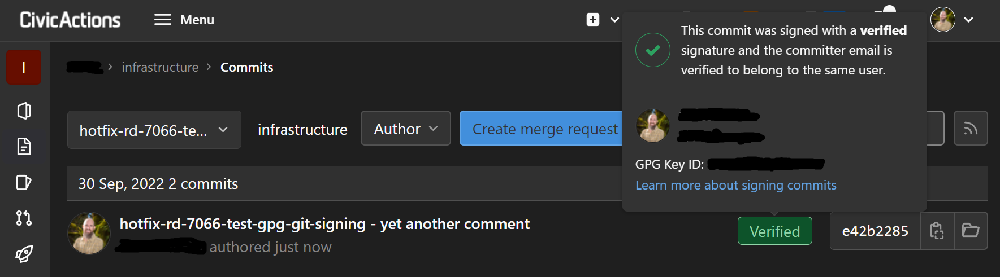

# Git

## Git overview

As you may already know, Git is a source code versioning system that lets you locally track changes and push or pull changes from remote resources. All projects use Git.

Here are some references to review if you are unfamiliar with it.

-   [Pro Git book](https://git-scm.com/)
-   [Github resources](https://docs.github.com/en/get-started/quickstart/git-and-github-learning-resources)
-   [Getting Git Right](https://www.atlassian.com/git/)
-   [Version Control with Git book](https://www.amazon.com/Version-Control-Git-collaborative-development/dp/1449316387)

Here are more advanced resources to learn "how Git works" at a lower level, which is helpful for building your mental model for using rebasing, reflog, etc.

-   <https://www.youtube.com/watch?v=MYP56QJpDr4>
-   [Non-video companion to the first half](https://git-scm.com/book/en/v2/Git-Internals-Git-Objects)

## Git best practices

_Note: your project may include other code review practices. Please review your project developer/contributor documentation!_

-   Atomic commits:
    -   Generally commits should be as small as possible.
    -   The code should be in a functional state after each commit (even if incomplete). Avoid committing code which will won't run at all.
-   Write good commit messages. A good commit message should:
    -   Reference the associated ticket ID using a prefix, such as `ABC-123:`. This makes it easier to locate tickets from git log/blame output as well as helping make sure all work is associated with a ticket.
    -   Have a one line (max 80 char) title/summary of the change, followed by a blank line and then further detail which should:
        -   Explain the reason(s) for the change.
        -   Detail what changed and any consequences of this (on code, data, users, security, etc.). Include any key terms that would help a future person searching commits.
        -   Often this will include the same detail that you might include in code comments.
-   Feature branches, pull requests (PR) and merge requests (MR):
    -   These should contain a closely-related series of commits that solves a single problem. Avoid including changes that are unrelated.
    -   Most often a single (well scoped) ticket will be resolved in a single PR or MR.
        -   However, it is good to break larger changes over multiple PRs or MRs that each address a logical piece of the whole. This can make the code easier to review.
    -   When merging PRs and MRs, we prefer a rebase workflow with fast-forward merges (rather than a merge commit) since this retains a clean and linear commit history which can be helpful for future engineers.
        -   For small PRs or MRs where there isn't much commit detail, using a squash-merge approach can also be fine.
-   We rebase commits on a feature branch for 2 reasons:
    -   To update the feature branch on top of more recent changes in master so that it can be easily merged when ready.
    -   To adjust the commits on the branch with an interactive rebase. For example:
        -   Squashing 2 together that make more sense as one change.
        -   Splitting a large commit into 2+ smaller ones.
        -   Adjusting the wording of commit messages (see above).
        -   Dropping any temporary/scratch commits.
    -   When rebasing a feature branch, it's encouraged to leave commits showing earlier attempts, even if you later found a better approach.
        -   This helps "tell the story" of the change. Someone digging though the history may wonder why the first approach didn't work.
        -   It also leaves the code available in the history in case you later find a use for that work.

### Git best practice resources

-   <https://blog.mocoso.co.uk/talks/2015/01/12/telling-stories-through-your-commits/>
-   <https://about.gitlab.com/blog/2018/06/07/keeping-git-commit-history-clean/>

## Code review

_Note: your project may include other code review practices. Please review your project developer/contributor documentation!_

-   Code reviews are shared between all developers. If you finish a ticket (or just want a break), check for outstanding PRs or MRs before picking up a new ticket.
    -   This is because getting shared awareness of the code others are working on helps the team learn and become more able to work across all areas of the codebase.
    -   If reviewing code that is outside your area of expertise, you can always ask for a second set of eyes.
    -   On most projects, code review is done at the same time as some level of functional testing using a review environment specific to the PR or MR.
-   Review using a [phased process](https://sage.thesharps.us/2014/09/01/the-gentle-art-of-patch-review/) that starts at the big picture, giving feedback (as needed) and getting alignment (as needed) on one phase before moving on. This avoids excessive detail early on and is more helpful to the developer.
    1. Is the idea behind the PR or MR sound?
    2. Is the PR or MR architected correctly?
    3. Is the PR or MR polished?
-   For code that touches complex or risky areas, such as security or performance implications, it's great to have 2 or even 3 reviewers take a look before merging.
-   Most coding standards should generally be applied automatically using code auto-formatting tools and/or reviewed automatically using code linting and code quality checking tools.
    -   If this is not the case on your project, add this in your CI pipeline!
-   Quality code is human friendly (self documenting, maintainable, adaptable)
-   Try to make at least one point for improvement: encourage conversation
-   Call out good code: praise is valuable feedback
-   Put feedback in the form of questions: encourage collaboration

### Core review resources

-   <https://sage.thesharps.us/2014/09/01/the-gentle-art-of-patch-review/>
-   <https://mtlynch.io/human-code-reviews-1/>
-   <https://mtlynch.io/human-code-reviews-2/>
-   <https://martinfowler.com/books/refactoring.html>
-   <https://www.pearson.com/us/higher-education/program/Martin-Clean-Code-A-Handbook-of-Agile-Software-Craftsmanship/PGM63937.html>

## Standard Git workflow

_Note: your project may include other Git workflows. Please review your project developer/contributor documentation!_

-   Our standard workflow uses:
    -   Trunk-based development with a single `master` branch, meaning no additional long lived branches (e.g. `stable`) that get repeated merges
    -   Short-lived feature branches living in developer forks with PRs or MRs for all work
    -   Feature branches should be prefixed with the related ticket ID. For example: `abc-123-my-feature`.
    -   We often rebase feature branches and use fast-forward merges
-   We follow an [upstream first](https://www.chromium.org/chromium-os/chromiumos-design-docs/upstream-first) practice for all development - this means:
    -   If the code you want to change is in an external library or module, contribute the change to that library first before bringing it into your actual project (e.g. by adding the patch to a build tool or adjusting the source to point to an upstream that includes the change)
    -   If you need to make a hotfix, make a PR or MR to the main `master` branch first before creating or patching a hotfix branch.
-   Feature branches undergo both automatic and manual testing before being merged. This makes sure that master always passes tests.
    -   Testing often includes linting and unit and functional tests, as well as specialised tests such as security and accessibility scans.
    -   On most projects a dedicated review environment for each feature branch or PR or MR is created automatically and can be used for manual testing as well as stakeholder demos and user testing as needed to validate functionality before the branch is merged.

Compared to other documented workflows:

-   [GitLab Flow](https://about.gitlab.com/topics/version-control/what-is-gitlab-flow/) - similar, although we prefer tags over environment branches
-   [GitHub Flow](https://docs.github.com/en/get-started/quickstart/github-flow) - similar, although we prefer rebase/fast-foward merges and don't deploy feature branches into production (but to review environments instead)
-   [Git flow](https://nvie.com/posts/a-successful-git-branching-model/) - not very similar: ours is much simpler and avoids long lived branches and repeated merges

## Versioning releases

_Note: your project may include other versioning practices. Please review your project developer/contributor documentation!_

For libraries, we use [semantic versioning](https://semver.org/).

For web sites or applications we use an `vX.Y.Z` syntax with the following meaning:

-   X: The sprint number
-   Y: A zero-based counter indicating the number of releases to the stage environment
-   Z: A zero-based counter indicating the number of hotfix releases to the prod environment

So in the normal release flow:

-   First sprint, pushes to stage has tag v1.0.0
-   Further work and a v1.1.0 tag is created and pushed to stage
-   Over the course of the sprint you might get v1.2.0, v1.3.0 etc
-   Sprint 1 ends, v1.3.0 looks good, gets pushed to prod

In the case a subsequent hotfix is required:

-   In Sprint 2 work continues on master, v2.0.0 tag gets pushed to stage etc.
-   Meanwhile, critical bugfix needed on prod, so the v1.3.0 is branched to v1.
    -   There is no need for further suffixes in the branch name, since it's the only branch for sprint 1
    -   We don't typically create these branches until they are needed, since it's hopefully rare to need critical hotfixes and we have a tag documenting the state of the release.
-   Fix is pushed to master (i.e. upstream-first workflow), then cherry-picked to v1.
-   Tag v1.3.1 is then created from the v1 branch, pushed to stage (or some dedicated hotfix stage environment) and then to prod.
-   If another hotfix is needed, that commit would also be merged to master, cherry-picked into v1 and tagged v1.3.2 etc.

In a continuous deployment project these tags can be created automatically, or some other mechanism may be used to track releases.

## Git configuration

Here is a recommended Git configuration block that it is recommended to add to your `~/.gitconfig`:

```gitconfig
##
## These are standard CivicActions git settings for developers
##
[core]
  # This is for MacOS or Linux. For Windows set to `true`.
  autocrlf = input
[merge]
  ff = only
[pull]
  ff = only
[commit]
  gpgsign = true
```

## Commit signing

Commit signing allows for identification and non-repudiation of individual commits to repositories in both Github and Gitlab. It improves security of our repositories by ensuring we know who made changes. The following instructions describe how to create a new GPG keypair, associate it with your Github and Gitlab accounts, and enable commit signing by default with Git.

### Creating a new GPG key

**Note: It is possible to use an SSH keypair to sign commits, but these instructions cover using GPG keys.**

Follow the instructions for [setting up GnuPG](../../common-practices-tools/security/gnupg.md) to create a new GPG key.

### Add your GPG key to Github and Gitlab

Get the ascii version of the public key that corresponds to our secret key and paste the public key block into Github and Gitlab. Copy from the "BEGIN PGP..." header to "END PGP..." footer.

Add to your [Gitlab User Settings -> GPG Keys](https://git.civicactions.net/-/profile/gpg_keys).

Add to your [Github Settings -> SSH and GPG Keys](https://github.com/settings/keys).

### Configure Git to sign commits

[Telling Git about your signing key - GitHub Docs](https://docs.github.com/en/authentication/managing-commit-signature-verification/telling-git-about-your-signing-key)

[Signing commits - GitHub Docs](https://docs.github.com/en/authentication/managing-commit-signature-verification/signing-commits)

Configure Git to use your GPG key for signing commits:

```shell
git config --global user.signingkey FF342ASDF39B2
```

Set a global default to sign with gpg:

```shell
git config --global commit.gpgsign true
```

Add an environment variable to your shell startup for GPG TTY so that it knows where to prompt for the key passphrase:

```shell
vi ~/.bashrc

export GPG_TTY=$(tty)
```

Add a commit as normal:

```shell
git commit -m 'updates to prod maintenance notes'
[main ef7ceb3] updates to prod maintenance notes
 1 file changed, 70 insertions(+), 1 deletion(-)
```

It will prompt for the GPG key passphrase before proceeding. The new commit on Github now shows a green "Verified" logo and overlay:


A signed commit on Gitlab will look similar:


### Configure gpg-agent to cache your private key passphrase

To make things easier, from the docs:

> "To store your GPG key passphrase so you don't have to enter it every time you sign a commit, we recommend using the following tools:
>
> -   For Mac users, the [GPG Suite](https://gpgtools.org/) allows you to store your GPG key passphrase in the Mac OS Keychain.
> -   For Windows users, the [Gpg4win](https://www.gpg4win.org/) integrates with other Windows tools.
>     You can also manually configure [gpg-agent](https://linux.die.net/man/1/gpg-agent) to save your GPG key passphrase, but this doesn't integrate with Mac OS Keychain like ssh-agent and requires more setup."

Set a long cache time for the gpg-agent, so that you don't have to enter the passphrase every time:

```shell
# Update the ttls:
vi .gnupg/gpg-agent.conf
default-cache-ttl 34560000
max-cache-ttl 34560000

# Restart the gpg-agent:
gpgconf --kill gpg-agent
gpg-agent --daemon
```

The agent will start up automatically the first time you make a commit.

**Note: If your terminal window is too small for the password prompt, the commit will return an error like the following. To fix, just increase the size of your terminal window.**

```shell
git commit -m 'rd-7609-stage-rsync-known-hosts-aide - test commit to show gpg sig failure'
error: gpg failed to sign the data
fatal: failed to write commit object
```

## GitLab, GitHub, and Bitbucket

GitLab, GitHub, and Bitbucket are services that provides remote access to Git repositories. In addition to hosting your code, these services provide additional features designed to help manage the software development lifecycle. These additional features include managing the sharing of code between different people, bug tracking, wiki space and other tools for "social coding".

-   GitHub is a publicly available, free service which requires all code (unless you have a paid account) be made open. Anyone can see code you push to GitHub and offer suggestions for improvement. GitHub currently hosts the source code for tens of thousands of open source projects. CivicActions uses GitHub for all open source projects (except those which are better hosted on an open source community infrastructure), as well as internal, client or pro-bono projects that should be developed in public.

-   GitLab is an open source GitHub like software that organizations can use to provide internal management of Git repositories. CivicActions has setup a GitLab server for internal and client projects that should not be developed in public. <https://git.civicactions.net>

### Moving code between GitLab, GitHub, and Bitbucket

All you have to do is point or rebase your local copy to the new remote source. Please note, only your source code will move. Any additional features you use (wiki, bug tracking, etc.) will need to be manually copied.

### When to use GitLab vs. GitHub

CivicActions uses GitHub for all open source projects (except those which are better hosted on an open source community infrastructure), as well as internal, client, or pro-bono projects that should be developed in public.

Use GitLab for internal and client projects that should not be developed in public. (This is going to be most of them).
